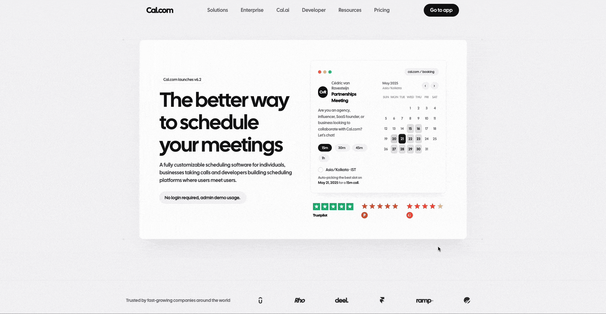

## ⚠️ Known Network Limitation

The application may not load correctly on some restricted networks 
(e.g., certain college or office Wi-Fi)
If the app does not load:
- Try accessing it using mobile data or another network.


<p align="center">
  
</p>

# Cal.com Clone: Scheduling & Booking Platform

<p>
  
</p>

A high-performance, full-stack scheduling platform inspired by Cal.com. This application replicates the core booking experience, allowing users to manage meeting types, set granular availability, and share public booking links.

---

### ✨ Key Features

#### 1. Event Types Management
- Create event types with title, description, duration (in minutes), and a unique URL slug.
- Edit and delete existing event types.
- View all event types on the admin dashboard.
- Each event type automatically generates a unique public booking link.

#### 2. Availability Settings
- Configure available days of the week (e.g., Monday–Friday).
- Define daily availability time ranges (e.g., 9:00 AM – 5:00 PM).
- Set the timezone for the scheduling system (supports Asia/Kolkata).

#### 3. Public Booking Page
- Interactive calendar interface to select a booking date.
- Display available time slots dynamically based on admin availability settings and existing bookings.
- Booking form to collect the booker’s name and email.
- Prevent double booking of the same time slot using backend validation.
- Confirmation page displaying booking details after successful scheduling.

#### 4. Bookings Dashboard
- View upcoming bookings.
- View past bookings.
- Cancel an existing booking from the dashboard.

### 🚀 Bonus Features Implemented

- **Email Notifications**: Automated booking confirmation and cancellation emails using SMTP with Nodemailer.
- **Buffer Time Between Meetings**: A 15-minute buffer is automatically enforced between meetings to prevent back-to-back bookings. The buffer logic is handled on the backend.

----

### Tech Stack
- **Frontend**: React.js, Tailwind CSS, Lucide Icons, Axios.
- **Backend**: Node.js, Express.js.
- **Database**: MySQL with a relational schema optimized for scheduling.
- **Tools**: Day.js for time manipulation, Docker for containerized deployment.
- **Deploy**: Vercel for client-side and AWS EC2 for server-side.

### 📊 Database Schema
The database is structured to handle complex scheduling relationships:
- `event_types`: Stores meeting configurations (title, duration, slug).
- `availability`: Manages weekly recurring slots and timezone data.
- `bookings`: Tracks all scheduled events with relationship to event types.

---
### 🚀 Technical Highlights

- **Advanced Slot Generation Logic**: Implemented a pure math-based slot engine with overlap detection, 15-minute booking buffer, and past-time filtering to ensure conflict-free, human-friendly scheduling.
- **Global Error Handling**: A centralized error-handling middleware (`server/src/middlewares/errorMiddleware.js`) captures all exceptions across the API, ensuring consistent JSON error responses and simplified debugging.
- **Structural Modularity**: The codebase follows a clean, modular architecture separating concerns into:
  - **Routes**: Clean API endpoint definitions.
  - **Controllers**: Practical request/response orchestration.
  - **Services**: Pure logic (like slot generation) decoupled from HTTP details.
  - **Models**: Efficient database interactions using SQL.
---
## 🚦 Getting Started

### Prerequisites
- Node.js (v18+)
- MySQL

### Local Setup
1. **Clone the Repo**:
   ```bash
   git clone <repository-url>
   cd calcom-scheduling-platform
   ```

2. **Backend Configuration**:
   ```bash
   cd server
   cp .env.example .env
   # Update .env with your MySQL and SMTP credentials
   npm install
   npm run dev
   ```

3. **Frontend Configuration**:
   ```bash
   cd ../client
   npm install
   npm start
   ```

### 🐳 Docker Support
Run the entire stack with one command:
```bash
docker-compose up --build
```

