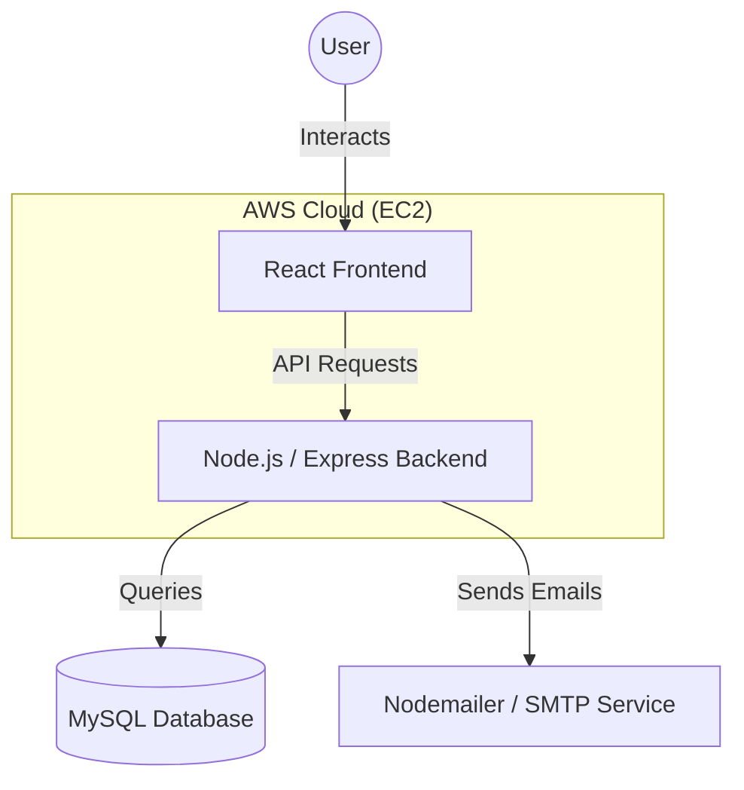

# 🗓️ Cal.com Clone: Scheduling & Booking Platform

[](https://react.dev/)
[](https://nodejs.org/)
[](https://expressjs.com/)
[](https://www.mysql.com/)
[](https://tailwindcss.com/)

A high-performance, full-stack scheduling platform inspired by Cal.com. This application replicates the core booking experience, allowing users to manage meeting types, set granular availability, and share public booking links.

---

## ✨ Key Features

### 🛠️ Admin Dashboard (Seed User)
- **Event Types Management**: Create, edit, and delete event types (e.g., 30-min discovery, 1-hour consultation).
- **Unique Slugs**: Each event type generates a dedicated public URL for booking.
- **Availability Control**: Set active days, time ranges, and timezones (supported for Asia/Kolkata).
- **Bookings Dashboard**: Real-time view of upcoming and past appointments with cancellation capability.

### 📅 Public Booking Flow
- **Interactive Calendar**: Elegant date selection with dynamic slot generation.
- **Availability Logic**: Time slots are automatically filtered based on admin settings and existing bookings.
- **Double-Booking Prevention**: Robust logic to ensure no two meetings overlap on the same event type.
- **Confirmation Page**: Instant feedback with meeting details upon successful booking.

### 🚀 Bonus Features Implemented
- **Email Notifications**: Automated confirmation/cancellation emails via SMTP (Nodemailer).

---

## 🏗️ Technical Architecture

### System Flow


### Tech Stack
- **Frontend**: React.js, Tailwind CSS, Lucide Icons, Axios.
- **Backend**: Node.js, Express.js.
- **Database**: MySQL with a relational schema optimized for scheduling.
- **Tools**: Day.js for time manipulation, Docker for containerized deployment.

### 📊 Database Schema
The database is structured to handle complex scheduling relationships:
- `event_types`: Stores meeting configurations (title, duration, slug).
- `availability`: Manages weekly recurring slots and timezone data.
- `bookings`: Tracks all scheduled events with relationship to event types.

---

## 🚦 Getting Started

### Prerequisites
- Node.js (v18+)
- MySQL

### Local Setup
1. **Clone the Repo**:
   ```bash
   git clone <repository-url>
   cd calcom-scheduling-platform
   ```

2. **Backend Configuration**:
   ```bash
   cd server
   cp .env.example .env
   # Update .env with your MySQL and SMTP credentials
   npm install
   npm run dev
   ```

3. **Frontend Configuration**:
   ```bash
   cd ../client
   npm install
   npm start
   ```

### 🐳 Docker Support
Run the entire stack with one command:
```bash
docker-compose up --build
```

---

## 🛠️ Code Modularity
The project follows a strict **Separation of Concerns**:
- **Frontend**: Modular component architecture (`/components/booking`, `/components/dashboard/`).
- **Backend**: Layered architecture with separate routes, controllers, and database models.
- **Middleware**: Centralized error handling and validation logic.

---

## 🌐 Deployment
The application is fully deployed and accessible:
- **Architecture**: Hosted on **AWS EC2** for robust performance and scalability.
- **Frontend & Backend**: Integrated deployment on a dedicated cloud instance.
- **Live Link**: [Cal.com Clone (Live)](http://your-ec2-public-ip-or-domain.com)

---

## 🛠️ Code Modularity
The project follows a strict **Separation of Concerns**:
- **Frontend**: Modular component architecture (`/components/booking`, `/components/dashboard/`).
- **Backend**: Layered architecture with separate routes, controllers, and models.
- **Middleware**: Centralized error handling and validation logic.
